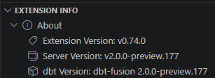

# Welcome to my repository on DBT tutorials

## Goals

After following tutorials in [dbtlabs learning](https://learn.getdbt.com/learn)  
I tried to make the dbt tutorial work with BigQuery, PostgreSql or Duckdb.

- BigQuery with Dbt Fusion and the dbt vscode extension (also working in dbt cloud).
- PostgreSql with Dbt core in sqlfluff venv (cf [Environment](./docs/Environment.md#python-venvs)).
- Duckdb with Dbt core in sqlfluff venv (cf [Environment](./docs/Environment.md#python-venvs)).

I tried to make the code as generic as possible.  
VSCode extension is made to work with dbt fusion.  
But it can be used to edit dbt core projects if you restrict to CLI in terminal.

There is a Git branch called [develop](https://github.com/mgn-dbt/tutorial/tree/develop) for BigQuery  

> The main difference with the develop_pg branch is in models/datamarts/extended.  
> BigQuery/Fusion uses the new Semantic Layer specifications

There is a Git branch called [develop_pg](https://github.com/mgn-dbt/tutorial/tree/develop_pg) for PostgreSQL and Duckdb  

> The main difference with the develop branch is in models/datamarts/extended.  
> Postgres/Dbt-core uses the legacy Semantic Layer specifications  
> There is 2 files which contains references to the database type (postgres/duckdb)
>> .sqlfluff  
>> dbt_project.yml

VSCode should not be used with Duckdb. See why in this [readme](./docs/Databases.md#duckdb)

Changing git branch (changing database) should be followed by closing/reopening terminal.  
Cf customized terminals in the [VSCode](./docs/VScode.md#user-configuration)

Table data is loaded separately cf [tutorial init](https://github.com/mgn-dbt/tuto-init)  
Seeds are not for loading real live data but lookup tables or mock data for tests.  
So this other project is a bit of an exception.

## VSCode

Cf [VScode](./docs/VScode.md)

## DBT

Beware :  
Upgrade the dbt vscode extension first.  
Don't upgrade dbt fusion first.  
Let VScode propose the right dbt fusion version.

You can choose the version of the dbt vscode extension.  
Under the dbt vscode extension page : `Uninstall / Install Specific Version`

Compatibility between the dbt fusion and the dbt vscode extension is important.  
Don't install a dbt fusion version ahead of the dbt vscode extension.



```powershell
iwr -uri https://public.cdn.getdbt.com/fs/install/install.ps1 -OutFile install.ps1
& install.ps1 -Version "2.0.0-preview.177"
Remove-Item install.ps1
```

or if fusion is already installed

```powershell
& install.ps1 -Update -Version "2.0.0-preview.177"
```

Check your PATH environment variable after using install.ps1.

NB : Fusion installation process updates the powershell profile files :  
Cf $env:USERPROFILE\Documents\Powershell\Microsoft.PowerShell_profile.ps1  
or $env:USERPROFILE\Documents\WindowsPowershell\Microsoft.PowerShell_profile.ps1  
It ensure dbtf alias is created.

Beware package-lock.yml yaml file, dbt fusion upgrade it with a bad format for dbt cloud.  
After executing "dbt deps" under source control "Discard changes" for package-lock.json.  
Keep dbt cloud version of package-lock.json for compatibility.  
Bug or new format ???

I put generic tests under "macros/generic" instead of "tests/generic" for convenience.  
They are macros so it seems their right place.

### Profiles.yml

Set environment variables.  
Cf [Environment variables](./docs/Environment.md#environment-variables)  
Cf [env_var](https://docs.getdbt.com/reference/dbt-jinja-functions/env_var)

Content of `$env:USERPROFILE\.dbt\profiles.yml`

```yaml
default:
  target: dev
  outputs:
    dev:
      type: bigquery
      threads: 4
      project: "{{ env_var('DBT_BIGQUERY_PROJECT') }}"
      dataset: dbt_tuto
      method: service-account
      keyfile: "{{ env_var('DBT_BIGQUERY_KEYFILE') }}"
      location: US
    prod:
      type: bigquery
      threads: 4
      project: "{{ env_var('DBT_BIGQUERY_PROJECT') }}"
      dataset: dbt_prod
      method: service-account
      keyfile: "{{ env_var('DBT_BIGQUERY_KEYFILE') }}"
      location: US
pg:
  target: dev
  outputs:
    dev:
      dbname: jaffle_shop
      host: localhost
      password: jaffle
      port: 5432
      schema: dbt_tuto
      search_path: dbt_tuto,public
      threads: 1
      type: postgres
      user: jaffle
      sslmode: verify-ca
      sslrootcert: "{{ env_var('DBT_PG_ROOT_CERT') }}"
    prod:
      dbname: jaffle_shop
      host: localhost
      password: jaffle
      port: 5432
      schema: dbt_prod
      search_path: dbt_prod,public
      threads: 2
      type: postgres
      user: jaffle
      sslmode: verify-ca
      sslrootcert: "{{ env_var('DBT_PG_ROOT_CERT') }}"
duckdb:
  target: dev
  outputs:
    dev:
      type: duckdb
      path: "{{ env_var('DBT_DUCKDB_DATABASE') }}"
      schema: dbt_tuto
      threads: 4
      # threads: 1  (for log_query_path to work)
      #settings:
      #  log_query_path: '.\offline\duck_tuto_query.log'   You can use a relative path (relative to your profiles.yml file)
    prod:
      type: duckdb
      path: "{{ env_var('DBT_DUCKDB_DATABASE') }}"
      schema: dbt_prod
      threads: 4 
      # threads: 1  (for log_query_path to work)
      #settings:
      #  log_query_path: '.\offline\duck_tuto_query.log'   You can use a relative path (relative to your profiles.yml file)
```

### Jinja

[Jinja cheatsheet](./docs/Jinja_cheatsheet.md)

### Semantic Layer (SL)

SL legacy spec example  
[SL Legacy](https://github.com/dbt-labs/Semantic-Layer-Online-Course/tree/fix/models/metrics)

SL new spec example  
[SL new specs](https://github.com/dbt-labs/Semantic-Layer-Online-Course/tree/fusion_spec/models/marts)

[SL Commands](https://docs.getdbt.com/docs/build/metricflow-commands)

New SL works only with dbt fusion and dbt cloud. => "dbt sl" command  

Commands

```cmd
dbt sl validate
dbt sl list metrics
dbt sl list dimensions --metrics m_large_order
dbt sl list entities --metrics m_large_order
dbt sl list saved-queries

Add [--compile] to verify SQL query
dbt sl query --metrics m_revenue --group-by metric_time --order-by -metric_time
dbt sl query --metrics m_new_customers --group-by metric_time --order-by -metric_time
dbt sl query --metrics m_new_customers --group-by metric_time --order-by -metric_time
dbt sl query --metrics m_new_customers --group-by metric_time__week --order-by -metric_time__week
dbt sl query --metrics m_food_revenue --group-by metric_time,order_items__is_food_item --limit 10 --order-by -metric_time --where "order_items__is_food_item = 1"
```

dbt core needs Legacy SL. => "mf" command  

Commands (dbt core)

```cmd
mf validate-configs (instead of validate)
Add [--explain] to verify SQL query instead of [--compile]
--order (instead of --order-by)
```

Beware entity names :  
Entities must have the same name between primary model and foreign model for automatic join to operate.  
For convenience my entities begin with "e_".  
[Join logic](https://docs.getdbt.com/docs/build/join-logic)

### JSON

json schema  
cf [dbt jsonschema](https://github.com/dbt-labs/dbt-jsonschema)  
cf [dbt artifact jsonschema](https://schemas.getdbt.com/)

json schema applied is specified in .vscode/settings.json

### Resources

- Learn more about dbt [in the docs](https://docs.getdbt.com/docs/introduction)
- Check out [Discourse](https://discourse.getdbt.com/) for commonly asked questions and answers
- Join the [dbt community](https://getdbt.com/community) to learn from other analytics engineers
- Find [dbt events](https://events.getdbt.com) near you
- Check out [the blog](https://blog.getdbt.com/) for the latest news on dbt's development and best practices
