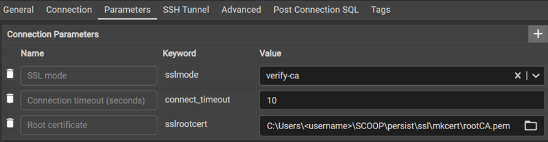

# Databases

## BigQuery

BigQuery can be used in Dbt Fusion and Dbt-core.

[Specific BigQuery](https://docs.getdbt.com/reference/resource-configs/bigquery-configs)

## PostgreSQL

PostgreSQL can only be used in Dbt-core.

[Specific PostgreSQL](https://docs.getdbt.com/reference/resource-configs/postgres-configs)

### in Podman

Cf [dbt-podman](https://github.com/mgn-dbt/dbt-podman)

### in SCOOP

For PostgreSQL in SCOOP, Dbt-core can be installed in a python venv.  
Cf [Environment](./Environment.md)

Start instance :

```Powershell
pg_ctl.exe start
```

Connect as DBA :

```Powershell
chcp 1252
psql.exe -U postgres
```

#### Create roles and database

```sql
set password_encryption = 'scram-sha-256';

CREATE ROLE jaffle WITH
LOGIN
NOSUPERUSER
INHERIT
NOCREATEDB
NOCREATEROLE
NOREPLICATION
NOBYPASSRLS
ENCRYPTED PASSWORD 'xxxxxxxxxxxx';

CREATE ROLE lecteur WITH
LOGIN
NOSUPERUSER
INHERIT
NOCREATEDB
NOCREATEROLE
NOREPLICATION
NOBYPASSRLS
ENCRYPTED PASSWORD 'xxxxxxxxxxxx';

CREATE DATABASE jaffle_shop
WITH
OWNER = postgres
ENCODING = 'UTF8'
LOCALE_PROVIDER = 'libc'
CONNECTION LIMIT = -1
IS_TEMPLATE = False;

GRANT CONNECT ON DATABASE jaffle_shop TO lecteur;

GRANT  ALL ON DATABASE jaffle_shop TO jaffle;

REVOKE ALL ON DATABASE jaffle_shop FROM public;
```

Before exiting psql, secure the postgres (DBA) account

```sql
ALTER USER postgres PASSWORD 'xxxxxxxxxxxx';
```

\q to exit psql

PostgreSQL connection should be established under SSL/TLS for security.

Cf [mkcert](https://github.com/filosottile/mkcert)

```Powershell
$env:CAROOT=Join-Path $env:USERPROFILE SCOOP persist ssl mkcert
mkcert -install
mkcert -cert-file (Join-Path $(mkcert -CAROOT) "server.cert.pem") -key-file (Join-Path $(mkcert -CAROOT) "server.key.pem") localhost $(hostname).ToLower()
```

#### postgresql.conf and pg_hba.conf

Add this at the end of postgresql.conf

```conf
include_if_exists = 'instance.conf'
```

Add this in instance.conf in the same directory as postgresql.conf :

```conf
listen_addresses = '*'
password_encryption = scram-sha-256
ssl=on
ssl_min_protocol_version = 'TLSv1.2'
ssl_ca_file = 'C:\\Users\\<username>\\SCOOP\\persist\\ssl\\mkcert\\rootCA.pem'
ssl_cert_file = 'C:\\Users\\<username>\\SCOOP\\persist\\ssl\\mkcert\\server.cert.pem'
ssl_key_file = 'C:\\Users\\<username>\\SCOOP\\persist\\ssl\\mkcert\\server.key.pem'
```

Backup original pg_hba.conf.  
Overwrite pg_hba.conf with :

```conf
# TYPE      DATABASE        USER            ADDRESS                 METHOD
hostssl     all             all             0.0.0.0/0               scram-sha-256
hostssl     all             all             ::/0                    scram-sha-256
hostnossl   all             all             0.0.0.0/0               reject
hostnossl   all             all             ::/0                    reject
```

Restart instance

```Powershell
pg_ctl.exe restart
```

#### pgadmin 4

Solve embeded python certificate error

```Powershell
& (Join-Path $env:USERPROFILE SCOOP apps postgresql current "pgAdmin 4" python python.exe) -m pip install pip_system_certs
```

Test SSL/TLS connection with pgadmin 4



## Duckdb

Duckdb can be used in Dbt Fusion and Dbt-core.  
Duckdb interactive shell only works in sqlfluff venv though.  
Cf [Environment](./Environment.md)

[Specific Duckdb](https://docs.getdbt.com/reference/resource-configs/duckdb-configs)

Don't try using VScode with Duckdb.  
The Duckdb database is locked by the process connected to it.  
Only one process can read the database so VScode dbt extension lock it with the Language Server.  
There is no workaround.


Use Duckdb interactive shell instead.  
It opens duckdb ui in parallel with a command line to launch dbt commands.  

### Duckdb interactive shell

Cf [interactive shell](https://github.com/duckdb/dbt-duckdb/tree/master#interactive-shell)

In python sqlfluff venv :

```Powershell
& (join-path $env:USERPROFILE SCOOP persist python venvs sqlfluff Scripts activate.ps1)
python -m dbt.adapters.duckdb.cli --profile duckdb
```

```txt
Welcome to the duckdbt shell. Type help or ? to list commands.
duckdbt (jaffle_shop_init)> parse
13:00:08  Running with dbt=1.11.11
13:00:08  Registered adapter: duckdb=1.10.1
13:00:08  Unable to do partial parsing because config vars, config profile, or config target have changed
13:00:08  Unable to do partial parsing because profile has changed
13:00:08  Unable to do partial parsing because a project dependency has been added
13:00:09  Performance info: C:\Users\<username>\SCOOP\persist\_dev_\dbt\jaffle_shop_init\target\perf_info.json
duckdbt (jaffle_shop_init)>
duckdbt (jaffle_shop_init)> help

Documented commands (type help <topic>):
========================================
EOF    compile  deps  help  parse  run   snapshot
build  debug    exit  list  quit   seed  test
```

### Duckdb CLI

Launching :

```Powershell
duckdb.exe (join-path $env:USERPROFILE SCOOP persist _dev_ dbt tuto.duckdb)
```

```sql
tuto D .tables raw%
 ────────────────────────────── tuto ───────────────────────────────
 ───────────────────────── dbt_tuto_seeds ──────────────────────────
┌───────────────────────┐┌────────────────────┐┌────────────────────┐
│     raw_payments      ││     raw_orders     ││   raw_customers    │
│                       ││                    ││                    │
│ id            bigint  ││ id         bigint  ││ id         bigint  │
│ orderid       bigint  ││ user_id    bigint  ││ first_name varchar │
│ paymentmethod varchar ││ order_date date    ││ last_name  varchar │
│ status        varchar ││ status     varchar ││                    │
│ amount        bigint  ││                    ││      102 rows      │
│ created       date    ││      99 rows       │└────────────────────┘
│                       │└────────────────────┘
│       120 rows        │
└───────────────────────┘
tuto D select * from dbt_tuto_seeds.raw_payments limit 10;
┌───────┬─────────┬───────────────┬─────────┬────────┬────────────┐
│  id   │ orderid │ paymentmethod │ status  │ amount │  created   │
│ int64 │  int64  │    varchar    │ varchar │ int64  │    date    │
├───────┼─────────┼───────────────┼─────────┼────────┼────────────┤
│     1 │       1 │ credit_card   │ success │   1000 │ 2018-01-01 │
│     2 │       2 │ credit_card   │ success │   2000 │ 2018-01-02 │
│     3 │       3 │ coupon        │ success │    100 │ 2018-01-04 │
│     4 │       4 │ coupon        │ success │   2500 │ 2018-01-05 │
│     5 │       5 │ bank_transfer │ fail    │   1700 │ 2018-01-05 │
│     6 │       5 │ bank_transfer │ success │   1700 │ 2018-01-05 │
│     7 │       6 │ credit_card   │ success │    600 │ 2018-01-07 │
│     8 │       7 │ credit_card   │ success │   1600 │ 2018-01-09 │
│     9 │       8 │ credit_card   │ success │   2300 │ 2018-01-11 │
│    10 │       9 │ gift_card     │ success │   2300 │ 2018-01-12 │
└───────┴─────────┴───────────────┴─────────┴────────┴────────────┘
  10 rows                                               6 columns
tuto D .quit
```

### Duckdb ui

Launching :

```Powershell
duckdb.exe -ui (join-path $env:USERPROFILE SCOOP persist _dev_ dbt tuto.duckdb)
```

#### Export notebook

```sql
copy (
  select
    "json"
  from _duckdb_ui.notebook_versions
  where 1=1
    and title = 'MyNotebook'
    and expires is null
) to 'exported-notebook.json';
```
